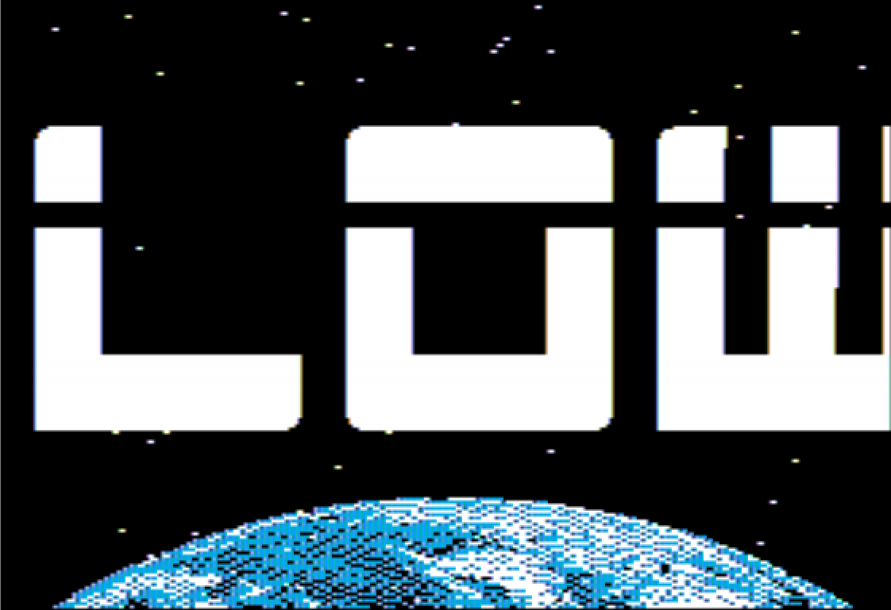
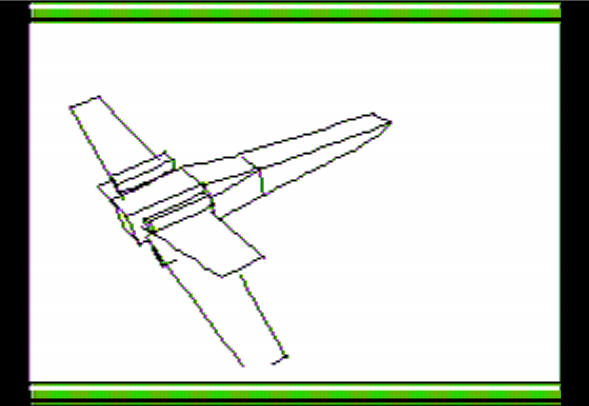

# Lowtech demo


<p align="center">
  
  
</p>


Lowtech demo is a demo written for the Apple ]\[+/e by
[Wiz](https://demozoo.org/sceners/16323/) of
[Imphobia](https://demozoo.org/groups/11375/) during 2020
and 2021. Just download the WOZ file (see releases) and run it in your favourite
emulator (right now, Mame and AppleWin will read it and emulate it
correctly).

I take the opportunity to thank all people who gave me time and
information when I was asking questions as well as all of those who
gave away the tools they wrote.  Without that generosity I would have
taken years to make that demo (which, for all practical situations,
means no demo at all).


# Running the demo on real hardware

You'll need a real floppy disk (memcard, emulators, etc.  don't have
proper timings), a MockingBoard (or compatible) and 64KB of
memory. You can just prepare a regular floppy with the released DSK
image, there's no fancy sector format.  An Apple 2e seems the best fit
(that's where the demo was tested anyway, twice).

# Dev notes

Below are some explanations of how Lowtech works. It might be
interesting for the curious reader.

## The scroller

The big scroll at the beginning of the demo is just an application of
delta drawing : I just draw and erase the part of the images that need
it. The whole point is to be clever about what parts.

Beyond that, the optimisation relies on the fact that the logo is made
of tiles. So, it reduces to a few very simple components.  The code is
quite optimized in that each tile is pre-ROLed and code for
drawing/clearing it is generated for each of them. So lots of code
generation.

One may have done better by observing that tiles are often surrounded
by the same set of other tiles. So you could maybe draw several
tiles at once, reducing the number of index lookups in the tile table
as well a JSR/RTS needed to call the tile drawing code.

## The disk I/O routine

The disk I/O routine is probably the part I'm most proud of because
without it that demo would not have been possible, especially the 3D
part.

That routine allows the floppy disk to be read while music is playing.
So the whole magic is to interleave music and disk I/O in a seamless
way. That's very tricky to achieve and to this day I'm still not sure
it is 100% optimized. As you may know, reading disk on the Apple ]\[
requires the CPU fulltime (because it reads nibble by nibble, so while
you read, you can't draw, you can't play music, you certainly can't be
interrupted by an IRQ).  So the whole point is to make sure we start
the reading when a sector is available and not too much before, else
the CPU will spend time waiting for the sector to come below the read
head.

Thanks to that disk I/O routine, I can load data while playing music
and doing demo effects.

The sectors are read with a copy of RWTS code (thanks Apple :-)).

## The 3D

The 3D part is built upon something that has nothing to do with 3D,
that is a disk I/O routine, see above.

Once we have a proper disk I/O, it is relatively easy to stream the 3D
data out of the disk. The next step is to make sure we read the less
possible so we can spend time drawing instead of streaming.

As you may now have guessed, the 3D is mostly precomputed.
However, it's not easy and you'll see that it's quite involved.

The first piece of code that is needed is something to import data
from Blender. I import the meshes as well as the camera
transformations. A bit of algebra is needed here :-)

Then computing hidden face removal on simple vector graphics is not
easy. Using z-buffer is riddled with numerical issues so I actually
compute the exact intersections between each edges. So I basically
check for intersection between edges and triangles. This is n² but
given that I have not many edges/faces its bearable.

Once that is done I have a collection of edges. To reduce the number
of vertices to a minimum, I have to order the edges. For example, if
you have egde AB,CB,CD you can store : ABCD (avoiding to store B and C
twice). When you have 40 edges that problem becomes tricky as it
is akin to a travelling salesman problem which is NP complete. Even
with a few dozens of edges that problem is not practical in Python.  A
rewrite in a faster language was needed, I chose Julia.  Then I used
mostly brute force + some heuristics to find a close to optimal set of
paths covering all edges (those of you who know about graph theory will
be at home here). Note that I have also tried a solution based on a
SAT-solver but it wasn't fast at all (which is expected as the SAT-solver,
although very smart, has no specific heuristics for graph stuff, I guess;
but SAT solvers are so cool I couldn't resist :-) )

Finally, once all the edges are stored, I just have to draw them. This
implies a division which is quite common and efficient. Then we
proceed to actual drawing. This is special on the Apple ]\[. I
basically cut each line in 7x7 tiles and the line is drawn one tile at
a time. The key insight here is that you don't need many tiles
(precomputed, in memory) to draw all possible lines.  Finally, lots of
tricks are used to make sure the code goes as fast as possible. The
biggest problem is to draw the first/last tile of line because they
are never drawn in full; that's quite like clipping and leads to
tedioous computations (which still have bugs...)

## Vertical scroll

Nothing fancy except that I have to do double buffering and handling a
scroll like that is a bit complicated.  The memcopy routine is quite
optimized. I also had fun making sure the letter positionning is
proportional.

## Loading

I had to make a fast loader (based Peter Ferrie's code), that is using
a bootloader which does the bare minimum.  I also use LZSA compression
(using Peter Ferrie's version).  In the end, I made a complete disk
building program to make sure to position the files exactly where we
need them in order to reduce read head movement.

## Tools used to create the demo

Tools I used :

* [Blender](https://www.blender.org/) for drawing and scripting the 3D sequence
* [Godot](https://godotengine.org/) to tile the big scroll
* [ca65](https://www.cc65.org) and [acme](https://sourceforge.net/projects/acme-crossass) for assembly
* [python](https://www.python.org/) to precompute lots of stuff and build the demo disk
* [julia](https://julialang.org/) to precompute and optimize 3D
* [Rgb2Hires](https://github.com/Pixinn/Rgb2Hires) to quickly get pictures to Apple format
* [dsk2woz](https://github.com/TomHarte/dsk2woz) to make *.woz disk images (slightly modified to introduce irregular timings)
* [LZSA](https://github.com/emmanuel-marty/lzsa) to crunch data
* [PT3 player](http://www.deater.net/weave/vmwprod/pt3_player/) to play music
* [grafx2](https://gitlab.com/GrafX2/grafX2) to pixel edit drawings
* [VortexTracker](https://bulba.untergrund.net/vortex_e.htm) to make music (yes I did my own music, for the worse :-) I promise I've tried to get a real musician onboard but nobody answered my mails)
* [AppleWin](https://github.com/audetto/AppleWin), [AIPC](https://github.com/sosaria7/appleinpc), [Mame](https://www.mamedev.org/) emulators
* [wine](https://www.winehq.org/) to run AppleWin on Linux
* [emacs](https://www.gnu.org/software/emacs/) and [Debian](https://www.debian.org/) as my work environment

## Recording the video

Recording the video was not easy as the support for that in emulator
is rather missing. The only emulator that does it is Mame but the
recording doesn't have the NTSC display simulation in it.

So what I did is this. First I took a copy of Shamus'
[Apple2 emulator](http://shamusworld.gotdns.org/apple2/).
Its source code is easy to work with and it's accurate enough for my
needs. I have hacked it so that it can record the HGR memory of
each frame (8Kb per frame, not much). Once I had the frames,
I have converted to png with NTSC artefacts using [hgr2rgb](https://github.com/Michaelangel007/hgr2rgbntsc).
Then I put back all the frames together in a video.
Now, Shamus's emulator doesn't play sound. So I recorded
sound with Mame and the remixed it in my video. Cool.
Bad news is that Mame's 1/60th of a second is not quite like
Shamus' 1/60th of a second. So I had to do a bit of synchronisation.
Awful. All of that is done in `shamus.sh` shell script.


## Building the demo

First, make sure to prepare the 3D data by installing and running the
Blender plugin `ExportAnimationAsSTLs.py`.  Then make sure to have a
compiled version of `src_ext/dsk2woz.c`

Then all build is done via the `build.py`tool. Make sure it has access
to all other tools it needs (check the code to update the paths to
those tools if needed).

```Bash
julia threed_crunch.jl   # This takes long (about a minute)
python disk.py   # Prepare disk I/O sync table (choregraphy files)
python --precalc --music --awin   # This will run the emulator too
```
